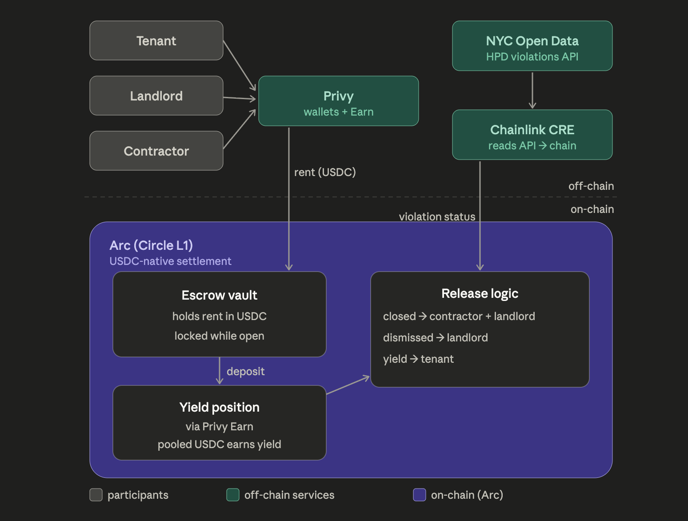

# NYC HPD Violation Tenant Protection <!-- temporary name — rename once finalized -->

> On-chain rent escrow that holds rent in USDC while a NYC HPD housing violation is open — and pays the withheld rent's yield to the tenant once it's resolved.

Built for **ETHGlobal New York 2026**.



<!--
Rename your chosen diagram to docs/architecture.png (image 2 / the dark version).
If you want the light/dark auto-swap later, replace the line above with a <picture> block.
-->

---

## What we're building

In New York, landlords are legally required to fix conditions flagged by **HPD** (Housing Preservation & Development). Today a tenant's only real leverage is to keep paying rent and hope it gets fixed, or to stop paying and risk eviction.

This project gives the tenant a third option: pay rent **into an on-chain escrow** instead of directly to the landlord while an HPD violation is open. The money is real, it's committed, and it's locked — but the landlord doesn't get it until the violation is actually resolved. That turns "please fix my apartment" into a funded incentive.

Everything settles in **USDC on Arc (Circle's L1)**. While the rent sits in escrow, the pooled USDC earns yield, and that yield goes to the tenant as compensation for the wait.

## How it works

1. **Rent goes into escrow.** Tenant, landlord, and contractor each have a wallet (via Privy). The tenant pays rent in USDC into the on-chain **escrow vault**. Funds are locked while the violation is open.
2. **Idle funds earn yield.** Escrowed USDC is deposited into a **yield position** via Privy Earn. Pooled deposits earn yield while locked.
3. **An oracle watches the violation.** **Chainlink CRE** reads the **NYC Open Data HPD violations API** off-chain and posts the violation status on-chain.
4. **Release logic settles based on status:**
   - `closed` (violation fixed) → principal released to **contractor + landlord**
   - `dismissed` (violation invalidated) → principal released to **landlord**
   - **yield → tenant**, in every case

The escrow only resolves on a verified state change reported by the oracle — no party can unilaterally pull the funds.

## Tech stack

| Layer | Choice |
|---|---|
| Settlement chain | Arc (Circle L1), USDC-native |
| Currency | USDC |
| Oracle | Chainlink CRE (NYC Open Data → on-chain) |
| Data source | NYC Open Data — HPD violations API |
| Wallets + yield | Privy (wallets + Earn) |
| Frontend | TBD (Nilesh) |

## Team & ownership

| Area | Owner |
|---|---|
| Arc smart contracts (escrow vault, release logic, settlement) | **Don** ([@don-delshah](https://github.com/don-delshah)) |
| Chainlink CRE integration | **Don** |
| NYC Open Data / HPD violations connection | **Don** |
| Frontend | **Nilesh** ([@nilesh-tabby](https://github.com/nilesh-tabby)) |
| Privy wallet + Earn integration | **Nilesh** |
| End-to-end integration | **Don + Nilesh** |

Built by the team at [Delshah Capital](https://www.delshah.com/).

## Repo structure <!-- adjust as the repo grows -->

```
/contracts      # Arc smart contracts: escrow vault, yield position, release logic
/oracle         # Chainlink CRE job + NYC Open Data HPD adapter
/frontend       # UI + Privy integration
/docs           # architecture diagram and notes
```

## Status

🚧 Early build — ETHGlobal NY 2026. Setting up the monorepo and wiring the first end-to-end path.

## Development notes

This project is being built during ETHGlobal NY 2026. Per event rules on AI tooling, AI-assisted work is attributed: spec files and prompts used are committed to the repo, and we keep an incremental commit history rather than large single-commit drops.
